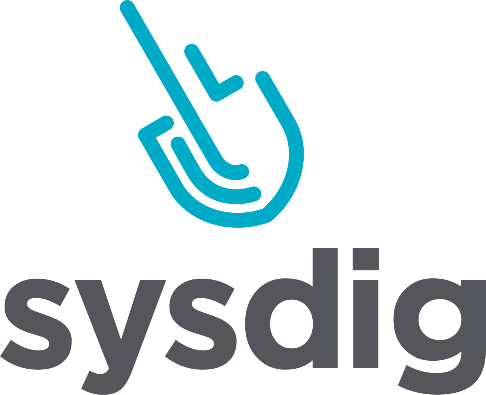

Cards Against Containers. Powered by Sysdig.

### About The Cards

Cards are built from this GitHub repository. If you would like to contribute a card idea for a future expansion pack please open up a pull request to this repository. The card idea will be reviewed by one of the OWNERS and at their discretion will be accepted to the repository for the next build.

The text used for the Cards against Containers questions can be found in [questions.txt](./questions.txt)

The text used for the Cards against Containers answeres can be found in [answers.txt](./answers.txt)

### Contributing Cards

You can open up a pull request directly to this repository, or you can open an issue in the [issue tracker](https://github.com/cardsagainstcontainers/deck/issues)

### Ordering Cards

You can order a pack of [physical cards](https://go.sysdig.com/cardsagainstcontainers) to be sent to you in the mail courtesy of Sysdig, Inc.   *WHILE SUPPLIES LAST, that sounded salesy!*

### Build your own Cards

We will be documenting our build process and how to build your own cards moving forward. Stay tuned for updates in this repository.
